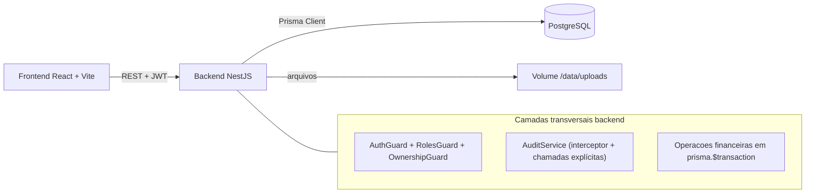
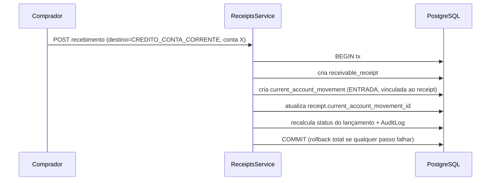

# Portal Financeiro Comercial — Plano Técnico

Projeto greenfield (diretório vazio, sem git). Este documento entrega os 12 itens solicitados. Nenhum código será criado antes da sua aprovação.

## Decisões confirmadas
- Monorepo com **npm workspaces** (sem Turborepo/Nx, para manter simples e portável no Coolify).
- **@tanstack/react-query** oficial no frontend para cache/estado de dados de servidor (queries, mutations, invalidação após escrita).
- Refresh token via **cookie httpOnly**; em Coolify com frontend e backend em domínios/subdomínios diferentes, cookie será `SameSite=None; Secure; Domain=.dominio-base` (subdomínios) ou tokens via header `Authorization` quando forem domínios totalmente distintos (ver seção 6). Access token JWT curto em memória no frontend.
- **CORS** explícito com `origin` da URL do frontend + `credentials: true` (ver seção 6).
- Anexos em **disco local com volume Docker persistente** montado em `/data/uploads` (ver seções 2 e 11), com `file_url` relativo servido pelo backend. Estrutura abstraída para trocar por S3/MinIO depois.
- **Estratégia única de estorno** (ver seção 8): manter o registro original, marcá-lo como estornado e criar um registro de estorno vinculado ao original (`reversal_of_*`). Nunca mutar o registro contabilizado.
- Banco único PostgreSQL; `schema.prisma` único no backend.
- Sem dark mode, pt-BR em toda a interface.

---

## 1. Arquitetura geral



- **Frontend SPA** (Vite) consome API REST. Estado de servidor gerenciado por **@tanstack/react-query** (cache, refetch, invalidação após mutations); estado de auth em contexto/`AuthProvider`.
- **Backend NestJS** modular: cada domínio é um módulo com Controller/Service/DTOs. `PrismaService` global. `AuditService` central. Guards de permissão.
- **Regras financeiras centralizadas** em services de domínio (`ReceivablesService`, `ReceiptsService`, `CurrentAccountsService`) e helpers puros (`status.util.ts`, `balance.util.ts`) — saldos e status NUNCA persistidos como verdade, sempre calculados.
- **Transações**: toda operação que toca saldo (recebimento, estorno, crédito em conta corrente, ajuste) roda dentro de `prisma.$transaction`.
- **Sem exclusão física**: soft-delete / cancelamento / estorno lógico em todas as entidades financeiras.

---

## 2. Estrutura de pastas do monorepo

```
portal-financeiro-comercial/
  package.json            # npm workspaces: ["backend","frontend"]
  docker-compose.yml      # db + backend + frontend; volumes: db_data, uploads_data
  .env.example            # raiz (compartilhado p/ compose)
  README.md
  # volumes Docker:
  #   db_data       -> persistência do PostgreSQL
  #   uploads_data  -> montado em backend:/data/uploads (anexos persistentes)
  backend/
    Dockerfile
    .env.example
    prisma/
      schema.prisma
      migrations/
      seed.ts
    src/
      main.ts
      app.module.ts
      common/            # guards, decorators, interceptors, filters, dto base, pagination
      prisma/            # PrismaModule + PrismaService
      auth/  users/  suppliers/  action-types/  receipt-methods/
      receivables/  receipts/  current-accounts/
      attachments/  notifications/  dashboard/  audit/  reports/
  frontend/
    Dockerfile
    .env.example
    tailwind.config.js
    src/
      main.tsx  App.tsx  router.tsx
      components/  layouts/  pages/
      features/{auth,dashboard,receivables,receipts,current-accounts,attachments,admin,settings}
      services/api/  hooks/  utils/  types/
```

---

## 3. Modelo de dados revisado (antes das migrations)

Mantém as 13 tabelas do prompt, com ajustes técnicos:

- **Tipos monetários**: todos os valores `Decimal @db.Decimal(14,2)`. Nunca float.
- **Enums Prisma**: `Role (ADMIN|COMPRADOR|DIRETORIA)`, `SupplierType`, `FinancialStatus (ABERTO|PARCIAL|QUITADO|CANCELADO)`, `DueStatus (EM_DIA|VENCE_HOJE|VENCIDO|SEM_VENCIMENTO)`, `ReceiptType (INTEGRAL|PARCIAL)`, `DestinationType (BAIXA_SIMPLES|CREDITO_CONTA_CORRENTE)`, `ConfirmationStatus (PENDENTE_CONFIRMACAO|CONFIRMADO|ESTORNADO|CANCELADO)`, `MovementType (ENTRADA|SAIDA|AJUSTE_POSITIVO|AJUSTE_NEGATIVO|ESTORNO)`.
- **`competence_month`**: armazenar como `String` no formato `AAAA-MM` (simples, indexável, sem ambiguidade de fuso). Validação por regex no DTO.
- **`financial_status`**: persistido como cache derivado (para filtros/índices), mas SEMPRE recalculado pelo service em cada escrita. **`due_status`**: NÃO é fonte de verdade — depende da data atual, então é **sempre recalculado em leitura** (listas, dashboard, filtros). Opcionalmente um **job diário** (cron `@nestjs/schedule`) atualiza um campo-cache `due_status` apenas para acelerar filtros/relatórios; a exibição nunca confia só no cache. Index em `(buyer_id, financial_status)`, `(expected_receipt_date)`, `(competence_month)`.
- **Vínculo recebimento <-> conta corrente** (1:1 opcional): `receivable_receipts.current_account_id` + `current_account_movement_id`; `current_account_movements.receivable_id` + `receivable_receipt_id`. FKs nullable.
- **Campos de estorno (estratégia única)**: `current_account_movements.reversal_of_movement_id` (self-FK nullable) aponta o movimento de ESTORNO ao movimento original; `receivable_receipts.reversal_of_receipt_id` (self-FK nullable) aponta o recebimento de estorno ao original. O original recebe `is_reversed/reversed_at/reversed_by/reverse_reason`; o registro de estorno carrega o `reversal_of_*`. Index nesses campos para rastreabilidade.
- **`attachments`**: polimórfico via `entity_type` + `entity_id` (sem FK relacional dura; validação no service). Soft-delete (`deleted_at/by/reason`).
- **`audit_logs`**: `old_values`/`new_values` como `Json`, `ip_address` opcional, sem updated/delete (append-only).
- **`current_account_users`**: tabela de junção com flags `can_view/can_move/can_edit`, unique `(current_account_id, user_id)`.
- **Campos de soft-delete/estorno padronizados** em receivables, receipts e movements conforme prompt.
- **Índices adicionais**: `users.user_number` unique; `suppliers.cnpj` unique parcial (nullable); FKs com `onDelete: Restrict` (proteção contra exclusão física).

Revisão será feita no `schema.prisma` e revisada com você antes de rodar `prisma migrate`.

---

## 4. Módulos backend NestJS

- **AuthModule** — login por `user_number`+senha, JWT access + refresh (cookie httpOnly), `/auth/me`, logout, rate-limit (`@nestjs/throttler`).
- **UsersModule** — CRUD admin, reset/alterar senha, hierarquia, ativar/inativar, último login.
- **SuppliersModule**, **ActionTypesModule**, **ReceiptMethodsModule** — cadastros auxiliares com inativação lógica.
- **ReceivablesModule** — lançamentos, status calculado, cancelamento lógico, filtros/paginação server-side.
- **ReceiptsModule** — recebimentos/baixas, integral/parcial, confirmação, edição com motivo, estorno; recálculo de saldo.
- **CurrentAccountsModule** — contas, compartilhamento/permissões, movimentações, saldo calculado, estorno.
- **AttachmentsModule** — upload validado (tipo/tamanho, bloqueio de executáveis), download por permissão, remoção lógica.
- **NotificationsModule** — geração (vencidos, vencendo, conta negativa, pendentes, compartilhadas, estornos), marcar como lida.
- **DashboardModule** — agregações de KPIs/gráficos por perfil.
- **AuditModule** — `AuditService` central + tela de consulta (admin/diretoria).
- **ReportsModule** — exportação Excel/CSV respeitando filtros.
- **Transversais**: `PrismaModule`, `common/` (guards, `@Roles`, `@CurrentUser`, filtro global de erros, interceptor de resposta padronizada, paginação).

---

## 5. Páginas e componentes frontend

**Páginas/rotas**: `/login`, `/dashboard`, `/lancamentos`, `/recebimentos`, `/conta-corrente`, `/conta-corrente/:id`, `/cadastros/fornecedores`, `/cadastros/descricoes-acoes`, `/cadastros/formas-recebimento`, `/admin/usuarios`, `/admin/auditoria`, `/perfil`. Itens de menu condicionados ao perfil.

**Layouts**: `MainLayout` (sidebar fixa 260px `#1e293b`, header sticky, conteúdo `lg:pl-[260px]`), `AuthLayout` (login full screen com gradiente + padrão de cruzes SVG).

**Componentes reutilizáveis obrigatórios**: `Card`, `KpiCard`, `DataTable` (header `bg-gray-50`, zebra, hover, ordenação, skeleton, empty state, paginação), `FilterBar`, `Modal`, `ConfirmDialog`, `StatusBadge`, `Pagination`, `LoadingSpinner`, `EmptyState`, `DateInput` (dd/MM/yyyy), `MoneyInput` (R$, Decimal-safe), `Select`, `TextArea`, `NotificationDropdown`, `FileUpload`, `AttachmentList`, `ReasonModal`.

**Tema** (`tailwind.config.js`): paleta `primary` 50–900 conforme prompt; classes globais `.btn-primary`, `.btn-secondary`, `.btn-danger`, `.card`. Gráficos Recharts com paleta corporativa definida.

**Badges** mapeados por enum (status financeiro, vencimento, confirmação, tipo de movimento, saldo, perfil) — cores exatamente como no prompt.

---

## 6. Autenticação e permissões

- Login `user_number` + senha; hash **argon2** (fallback bcrypt). Nunca retornar `password_hash`.
- **JWT access** curto (~15 min) + **refresh token** em cookie httpOnly (~7 dias), rotacionável.
- **Cookies/CORS no Coolify (frontend e backend em domínios/subdomínios diferentes)**:
  - Cenário recomendado — **subdomínios do mesmo domínio base** (ex.: `app.estrela.com` + `api.estrela.com`): cookie de refresh com `httpOnly; Secure; SameSite=None; Domain=.estrela.com; Path=/auth`. Frontend usa `fetch/axios` com `withCredentials: true`.
  - Cenário alternativo — **domínios totalmente distintos**: navegadores tratam como cross-site; manter `SameSite=None; Secure` e CORS com `origin` exato; se houver bloqueio de third-party cookies, fallback para refresh token enviado via header `Authorization`/body em vez de cookie.
  - **CORS** no `main.ts`: `origin` = URL exata do frontend (via env `FRONTEND_URL`), `credentials: true`, métodos e headers explícitos. Nunca `origin: *` com credenciais.
  - HTTPS obrigatório em produção (Coolify provê TLS); `Secure` exige HTTPS. Variáveis `COOKIE_DOMAIN`, `FRONTEND_URL`, `NODE_ENV` controlam o comportamento.
- Guards: `JwtAuthGuard` (global), `RolesGuard` (`@Roles`), `OwnershipGuard` para COMPRADOR (filtra por `buyer_id`/contas compartilhadas — impede acesso por troca de ID na URL).
- Bloqueio de usuário inativo no guard; `last_login_at` no login.
- `throttler` no `/auth/login`. CORS restrito, Helmet ativo.
- Matriz de permissões: COMPRADOR (próprios dados + contas compartilhadas), DIRETORIA (leitura global + relatórios), ADMIN (total: confirmar, cancelar, estornar, ajustar, gerir usuários/cadastros). Permissões sensíveis preparadas para configuração futura.

---

## 7. Estratégia de auditoria

- `AuditService.log({ userId, action, entityType, entityId, oldValues, newValues, reason, ip })`, append-only.
- Chamado dentro da MESMA transação das operações financeiras (consistência atômica entre dado e log).
- `old_values`/`new_values` capturados antes/depois no service. Motivo obrigatório repassado em cancelamento/estorno/edição sensível.
- Cobre todas as ações críticas listadas (lançamentos, recebimentos, confirmações, estornos, contas correntes, movimentações, usuários, senha, hierarquia, cadastros, anexos).
- Tela `/admin/auditoria` somente leitura (admin/diretoria), com filtros e exportação.

---

## 8. Estratégia de cálculo de saldos

- **Helpers puros** reutilizados por backend (fonte da verdade) e refletidos no frontend só para exibição.
- Lançamento: `saldo_aberto = amount - Σ recebimentos válidos` (não cancelados, não estornados, confirmados quando regra ativa).
- `financial_status`: CANCELADO > recebido=0 → ABERTO > 0<recebido<total → PARCIAL > recebido≥total → QUITADO.
- **`due_status` sempre recalculado em leitura** (listas, dashboard, filtros), porque depende da data atual. Cálculo on-the-fly via helper a partir de `expected_receipt_date` vs hoje. Job diário opcional (`@nestjs/schedule`) atualiza um campo-cache só para otimizar filtros/relatórios — a UI nunca confia apenas no cache.
- Conta corrente: `saldo = Σ entradas + Σ ajustes_positivos − Σ saídas − Σ ajustes_negativos` (apenas movimentos válidos, isto é, não estornados; movimentos de ESTORNO entram com sinal que neutraliza o original). Saldo negativo permitido, destacado em vermelho.
- **Estratégia única de estorno** (recebimentos e movimentos): (1) o registro original é mantido e marcado `is_reversed=true` + `reversed_at/by` + `reverse_reason`; (2) cria-se um registro de estorno NOVO com `reversal_of_receipt_id`/`reversal_of_movement_id` apontando o original; (3) tudo dentro de uma transação + auditoria. Não se edita/muta o registro contabilizado — para corrigir, estorna-se e relança-se.

### REGRA OBRIGATÓRIA — Sem dupla reversão no saldo
Para o cálculo de saldo NÃO pode haver dupla reversão. Regras fixas:

**Recebimentos (saldo do lançamento):**
- Recebimento original com `is_reversed=true` NÃO entra no saldo do lançamento.
- O registro de estorno de recebimento existe SOMENTE para rastreabilidade/auditoria e NÃO conta como novo recebimento positivo (não soma nem subtrai no saldo).
- O saldo do lançamento considera APENAS recebimentos válidos, confirmados e não estornados: `saldo_aberto = amount − Σ recebimentos (confirmados E is_reversed=false E reversal_of_receipt_id IS NULL)`.

**Conta corrente (regra contábil de extrato):**
- Ao estornar, a movimentação original PERMANECE no extrato, marcada como estornada (`is_reversed=true`), preservando histórico.
- Cria-se uma movimentação tipo `ESTORNO` vinculada à original por `reversal_of_movement_id`.
- Regra ÚNICA e consistente adotada neste projeto: o movimento original CONTINUA contando no saldo e o movimento de `ESTORNO` entra com SINAL INVERSO, neutralizando o efeito. (Não se usa a alternativa de "excluir original e ignorar estorno".)
- Portanto o saldo soma TODOS os movimentos não-fisicamente-excluídos: original (sinal normal) + estorno (sinal inverso) = efeito líquido zero para o par estornado.
- Nunca excluir fisicamente nem alterar o valor de um movimento já contabilizado.
- **Flag de configuração global** `RECEIPTS_AUTO_CONFIRM` (env/DB): controla se recebimento já nasce CONFIRMADO. Banco e código preparados para confirmação manual independentemente do valor inicial.
- Recálculo sempre dentro da transação após cada escrita; bloqueio de recebimento acima do saldo aberto.

---

## 9. Integração recebimentos x conta corrente



- Recebimento com `destination_type = CREDITO_CONTA_CORRENTE` exige `current_account_id`; cria ENTRADA vinculada bidirecionalmente, tudo numa transação.
- **Estorno integrado (estratégia única)**: estornar o recebimento, na mesma transação: (1) marca o recebimento original como `is_reversed`; (2) cria recebimento de estorno (`reversal_of_receipt_id`); (3) marca o `current_account_movement` original como `is_reversed`; (4) cria um movimento de ESTORNO na conta corrente com `reversal_of_movement_id` apontando o original; (5) recalcula ambos os saldos + auditoria.
- Edição de recebimento contabilizado/vinculado: NÃO se muta — exige estornar e relançar, preservando rastreabilidade via `reversal_of_*`.

---

## 10. Ordem de implementação por fases

- **Fase 0** — Consolidação técnica das regras (este documento aprovado).
- **Fase 1 — APENAS fundação técnica e visual**: monorepo, frontend Vite + Tailwind/tema, backend NestJS (esqueleto), `PrismaService`, PostgreSQL, Docker Compose (com volumes `db_data` e `uploads_data`), `@tanstack/react-query` configurado, layout (sidebar/header), biblioteca de componentes base e **tela de login apenas visual/estática** (sem fluxo de autenticação real, sem JWT, sem chamada de login funcional). Autenticação real fica 100% na Fase 2.
- **Fase 2** — Auth, usuários, permissões (login funcional, JWT + refresh, cookies/CORS Coolify, guards, seed admin).
- **Fase 3** — Auditoria base (`AuditModule`/`AuditService`, tela de consulta).
- **Fase 4** — Cadastros auxiliares (fornecedores, formas, descrições) com inativação lógica.
- **Fase 5** — Lançamentos (status calculado, filtros, cancelamento, anexos).
- **Fase 6** — Recebimentos/baixas (integral/parcial, confirmação, edição/estorno com motivo).
- **Fase 7** — Conta corrente (contas, compartilhamento, movimentações, extrato, estorno).
- **Fase 8** — Integração recebimentos x conta corrente (transacional).
- **Fase 9** — Dashboard (KPIs, gráficos, listas, visão por perfil).
- **Fase 10** — Notificações (sino, geração por regra).
- **Fase 11** — Relatórios/exportação Excel/CSV respeitando filtros.

Cada fase deve deixar o projeto rodando.

---

## 11. Riscos técnicos e pontos de atenção

- **Consistência de saldo**: erro mais grave; mitigar com helpers únicos + transações + testes de cálculo. Saldo nunca digitado.
- **Estorno integrado recebimento↔conta corrente**: caso mais complexo; preferir relançamento a mutação; cobrir com testes.
- **Concorrência**: dois recebimentos simultâneos podem ultrapassar saldo; usar transação + revalidação do saldo dentro da tx (lock otimista/`SELECT ... FOR UPDATE` via Prisma quando necessário).
- **`competence_month` como string**: validar rigorosamente (`^\d{4}-(0[1-9]|1[0-2])$`).
- **Decimal**: nunca converter para Number em cálculos financeiros; usar `Prisma.Decimal`/`decimal.js`.
- **OwnershipGuard**: garantir que COMPRADOR não acesse dados de terceiros por ID na URL/API — testar explicitamente.
- **Upload de anexos**: validar mime/tamanho, bloquear executáveis, evitar path traversal; servir com headers seguros. **Volume persistente** `uploads_data` em `/data/uploads` deve existir e ser montado tanto no Docker Compose quanto na configuração do Coolify (Persistent Storage), senão anexos somem a cada redeploy.
- **`due_status` dependente da data**: nunca confiar só no valor persistido; recalcular em leitura/dashboard/filtros e, opcionalmente, atualizar via job diário.
- **Cookies cross-domain no Coolify**: third-party cookies podem ser bloqueados pelo navegador; preferir subdomínios do mesmo domínio base; ter fallback de refresh via header. Validar `Secure`+HTTPS e CORS com `credentials`.
- **Estorno**: garantir que o registro de estorno e a marcação do original ocorram na MESMA transação para nunca deixar saldo inconsistente.
- **Segredos**: `.env` nunca versionado; só `.env.example`; logs sem senha/token.

---

## 12. Critérios de validação por fase

- **F1**: `docker compose up` sobe db+back+front; volumes `db_data` e `uploads_data` persistem; tela de login renderiza com identidade visual (estática, sem auth real); react-query provider ativo; healthcheck da API ok. Sem fluxo de autenticação funcional nesta fase.
- **F2**: login por número funciona; rotas protegidas bloqueiam sem token; inativo bloqueado; `password_hash` nunca retornado; seed admin (nº 1) loga.
- **F3**: cada ação crítica grava `audit_log` com old/new; tela de consulta filtra; logs são append-only.
- **F4**: cadastros criáveis/inativáveis; inativos não excluídos fisicamente; alterações auditadas.
- **F5**: lançamento criado com competência; vencido calculado automaticamente; status financeiro e de vencimento separados; parcial-vencido identificado; cancelamento exige motivo.
- **F6**: recebimento parcial mantém saldo residual e aparece em Recebimentos; integral quita e sai dos pendentes; pendente de confirmação não afeta saldo oficial até confirmar (conforme flag); edição/estorno recalculam saldo.
- **F7**: conta criável por fornecedor e compartilhável; entrada aumenta, saída reduz; saldo negativo vermelho; estorno via motivo; saldo sempre calculado.
- **F8**: recebimento gera crédito em conta corrente com vínculo bidirecional rastreável; falha faz rollback total; estorno integrado consistente.
- **F9**: dashboard mostra KPIs/gráficos corretos por perfil (comprador só os seus; diretoria/admin consolidado com filtro por comprador).
- **F10**: sino mostra vencidos, vencendo, contas negativas e pendentes; marcar como lida funciona.
- **F11**: exportações Excel/CSV respeitam filtros; valores em R$, datas dd/MM/yyyy, competência MM/yyyy.
- **Aceite final**: checklist do item 27 do prompt integralmente atendido; nenhum registro financeiro excluído fisicamente; roda via Docker/Coolify.